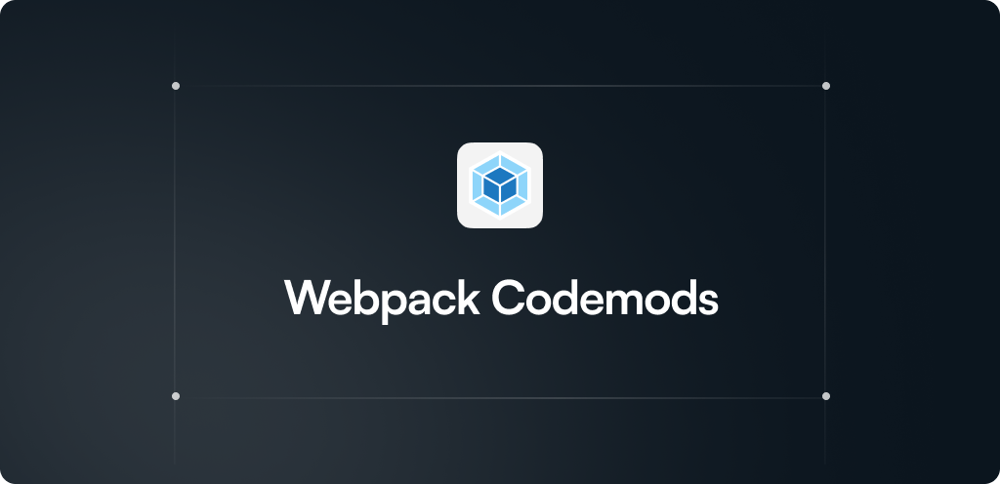

<h1 align="center">webpack codemods</h1>

This repository contains codemods (automated migrations) for webpack. These codemods facilitate adopting new features and upgrading to versions with breaking changes.

## Quickstart

```bash
# Run a specific codemod from the registry
npx codemod@latest webpack/v5/json-imports-to-default-imports

# Run the combined migration recipe
npx codemod@latest webpack/v5/migration-recipe

# Run locally from a recipe directory
codemod run -w workflow.yaml
```

See the [codemod CLI doc](https://go.codemod.com/cli-docs) for a full list of available commands.

## Available codemods

> [!CAUTION]
> These scripts change source code. Remember to commit any wanted and unsaved changes before running them.

To run codemods, use [`codemod`](https://go.codemod.com/github) command below:

```console
npx codemod @webpack/<recipe>
```

- `webpack/v5/json-imports-to-default-imports` — replace JSON named imports with default import
- `webpack/v5/migrate-library-target-to-library-object` — migrate `output.library` and `output.libraryTarget` to v5 format
- `webpack/v5/set-target-to-false-and-update-plugins` — move functional `target` into `plugins` and set `target: false`
- `webpack/v5/migration-recipe` — orchestrates the above in sequence

## Contributing

See [CONTRIBUTING.md](./CONTRIBUTING.md). Please commit or stash your changes before running codemods.

## Security

See [SECURITY.md](./SECURITY.md). Report vulnerabilities privately.

## License

MIT